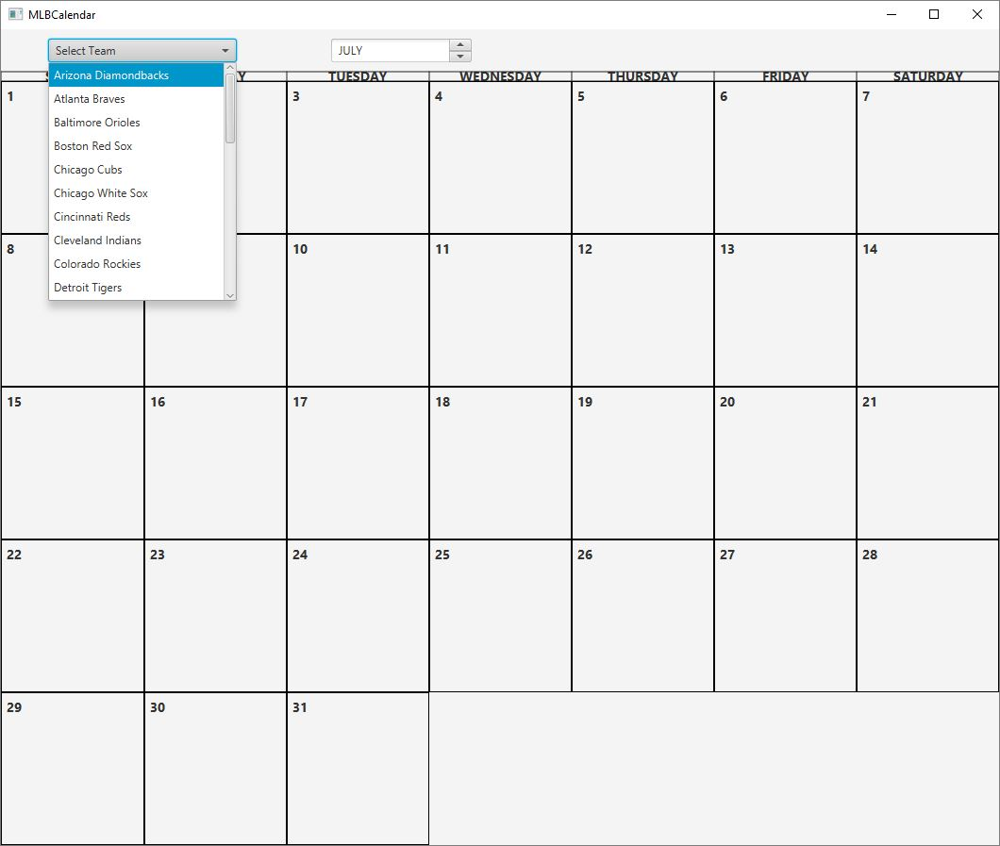
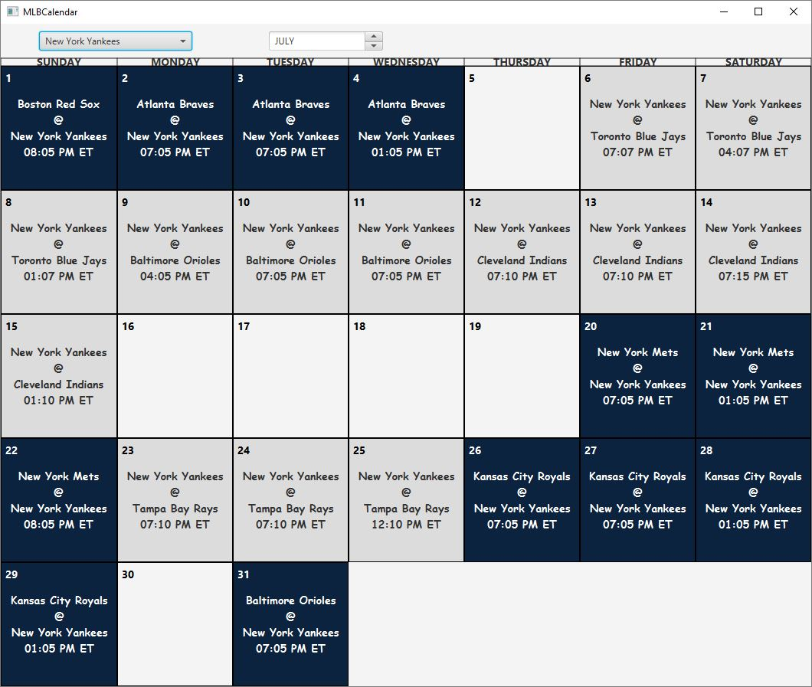

# MLBCalendar

Desktop app that shows the monthly MLB scehdule. The schedule is pulled from  StatsApi.MLB.com is JSON fromat.

After selecting the team, the calendar will fill with the schedule. Home games will be colored with team colors.

## Future plans
*Show double headers.
*Show Win/Loss for games already played.
*Show suspened games.
*Save previously selected team and schedule.

## Built With

* [Gluon Scene Builder](https://gluonhq.com/products/scene-builder/)
* [Maven](https://maven.apache.org/)
* [Gson](https://github.com/google/gson)
